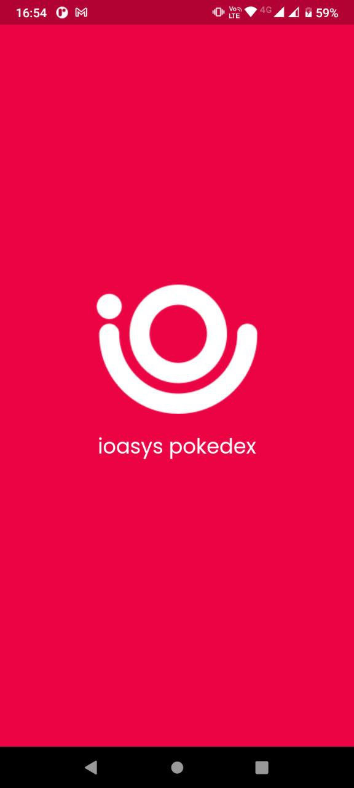

App flutter 'Pokemon' ioasys Camp 4ª edição 2022

Este app é baseado em um desafio do camp em Flutter da empresa ioasys. Telas do app:

1. Na primeira tela foi feita uma requisição para obter uma lista de pokemons. Também é possível fazer uma pesquisa por nome de pokemon (é realizada outra requisição); 
   
2. Tela de detalhes de um pokemon:  são mostrados os detalhes do pokemon clicado na tela anterior;

##

- Clean Architecture;
- Para requisições API REST: Dio;
- Para gerenciamento de estado: ValueNotifier;

##

      